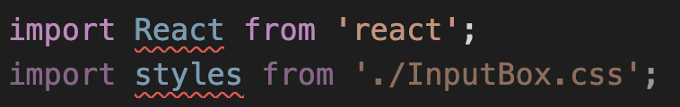
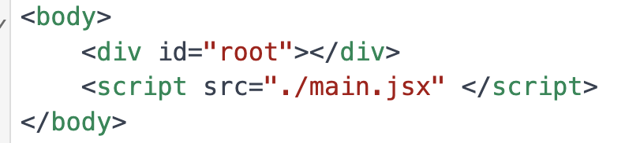

## Prompt 1
建置環境時，React語法錯誤，檔案路徑錯誤(需放在/styles/底下)

## Prompt 2
重新生成一遍，語法錯誤(script少右括號)

## Prompt 3
- App.jsx應該放在src/底下，不需放在components/底下
- App.css應該放在src/底下，不需放在styles/底下
- 不需要給我template.md, requirement.md
修改完以上問題，重新給我完整程式碼

### problems
沒給我components的名稱

## Prompt 4
給我每段程式碼的元件名稱與相對位址

### problems
少了`/components/` `/pages/`資料夾
沒寫打字網站的所有功能

## Prompt 5
- `Background.jsx`應該放在`/component/`底下
- `IndexPage.jsx`應該放在`/pages/`底下
程式沒有實作打字網站，幫我實作出來並給我程式碼

### problems
`App.js`, `Index.js`???
少了全部的css
